<div align="center">

<!-- Animated Header with Typing Effect -->


<!-- Wave Animation -->


<!-- Profile Views with Animation -->
<p align="center">
  
  
  
  
</p>

<!-- Animated Social Badges -->
<p align="center">
  <a href="https://www.linkedin.com/in/harshini-pothireddy/">
    
  </a>
  <a href="https://github.com/harshini1708">
    
  </a>
  <a href="mailto:harshini.pothireddy@sjsu.edu">
    
  </a>
  <a href="https://github.com/harshini1708">
    
  </a>
</p>

</div>

---

## About Me

I'm a **Software Engineer**, **Data Scientist**, **AI Engineer**, **Machine Learning Engineer**, and **Forward Deployment Engineer** with **3+ years of experience** building enterprise-scale cloud infrastructure, AI/ML systems, and data platforms at **Oracle/AWS** and **CCC Intelligent Solutions**. Currently pursuing my **Master's in Computer Software Engineering (Data Science Specialization)** at San Jose State University.

### What I Bring to the Table:

<table>
<tr>
<td width="50%" valign="top">

#### 🏗️ **Enterprise Architecture**
Designed and deployed cloud-native microservices on **<u>AWS EKS</u>** and **<u>OCI Kubernetes</u>** serving **10K+ customers** and processing **2M+ daily API requests** with **99.8% uptime**

#### 🤖 **AI/ML Engineering** & **Machine Learning Engineering**
Built production ML pipelines for **multimodal fraud detection**, **<u>NLP</u>-based risk intelligence**, and **<u>computer vision systems</u>** achieving **90%+ accuracy**

#### 📊 **Data Engineering** & **Data Science**
Developed scalable data platforms processing **300+ claims daily**, optimized **<u>MongoDB</u>** & **<u>PostgreSQL</u>** queries reducing latency **40-75%**, and automated infrastructure provisioning with **<u>Terraform</u>** & **<u>CloudFormation</u>**

</td>
<td width="50%" valign="top">

#### ⚡ **Performance Optimization**
Reduced deployment time **83%** (30min→5min), API latency **40-60%**, and infrastructure setup time **75%** (4hrs→15min) through intelligent caching, **<u>blue-green deployments</u>**, and automation

#### 🔬 **Research & Innovation**
Published research on **<u>distributed caching</u>** and **<u>deep learning for medical imaging</u>**, with expertise in **<u>PyTorch</u>**, **<u>TensorFlow</u>**, and **<u>transformer architectures</u>**

</td>
</tr>
</table>

### Core Competencies:

<div align="center">

<table>
<tr>
<td width="50%" align="left" style="border: 2px solid #404040; background: #0d1117; padding: 20px;">

**Production ML/AI Systems** | **Machine Learning Engineering**
**Data Science** | **AI Engineering**
**Cloud Infrastructure** (AWS/Azure/GCP/OCI)
**Distributed Systems & Caching**
**Kubernetes & Container Orchestration**
**Data Engineering & Analytics**

</td>
<td width="50%" align="left" style="border: 2px solid #404040; background: #0d1117; padding: 20px;">

**Software Engineering** | **Forward Deployment Engineering**
**CI/CD & DevOps Automation**
**Microservices Architecture**
**API Development** (REST/GraphQL)
**PyTorch/TensorFlow/scikit-learn**
**SQL & NoSQL Databases**

</td>
</tr>
</table>

</div>

---

## Professional Experience

###  **AI/ML Software Engineer Intern** | CCC Intelligent Solutions
*Jun 2025 - Present | Chicago, IL*

<details open>
<summary><b>Building multimodal AI systems for insurance claims processing</b></summary>

<br>

<div align="left">

- Optimized **PyTorch ViT inference** from 180ms→52ms using **torch.compile** and **Nsight profiling**
- Implemented **INT8/FP16 quantization** achieving **4x memory reduction** with only **1.6% accuracy degradation**
- Built inference microservice handling **200+ concurrent requests at 99.2% uptime** via **FastAPI + Docker**
- Profiled **CUDA kernel performance** identifying memory bandwidth bottlenecks in attention mechanisms
- Developed bias evaluation framework analyzing **demographic disparity by 15%** across protected attributes

**Tech Stack**:
<p align="left">


</p>

</div>

</details>

---

###  **Graduate Research Assistant - ML/Data Science** | San Jose State University
*Dec 2024 - Apr 2025 | San Jose, CA*

<details open>
<summary><b>Distributed Systems & Deep Learning Research</b></summary>

<br>

<div align="left">

- Implemented **federated learning with differential privacy** in PyTorch achieving **94% accuracy** on 5-node setup
- Developed **multi-GPU training pipeline** using **DistributedDataParallel** reducing epoch time **3.2x on 4x A100s**
- Benchmarked **FP16 and INT8 quantization** schemes analyzing accuracy-latency tradeoffs for edge deployment
- Profiled **inter-GPU communication** with **NCCL traces** optimizing all-reduce operations for synchronization
- Implemented **Python REST APIs with Redis Cluster** achieving **95% consistency** across 5 AWS distributed nodes
- Automated **AWS infrastructure provisioning via Terraform & CloudFormation** reducing setup time **75% (3hrs→15min)**

**Tech Stack**:
<p align="left">


</p>

</div>

</details>

---

###  **Software Engineer II - Cloud & Data Engineering** | Oracle Corporation
*Apr 2022 - Jan 2024 | Bengaluru, India*

<details open>
<summary><b>Enterprise cloud infrastructure & Kubernetes orchestration</b></summary>

<br>

<div align="left">

- Delivered **Java Spring Boot APIs** on **OCI Kubernetes** serving **10K+ customers** processing **2M+ daily API requests**
- Orchestrated **blue-green deployments with Helm** reducing release cycles **40%** while maintaining **99.8% uptime SLA**
- Optimized **PostgreSQL queries and MongoDB storage** reducing API response time **75% (8sec→2sec)**
- Automated **OCI infrastructure provisioning with Terraform** reducing cloud environment setup **from 4hrs to 15min**
- Implemented **OAuth 2.0 RBAC with Spring Security** securing API access for **50+ business units** across regions
- Integrated **cross-region storage APIs** connecting **OCI block storage with AWS S3** for hybrid data management
- Built **data pipelines** on OCI processing **40K+ daily transactions** with Python achieving **99.5% data quality**

**Tech Stack**:
<p align="left">


</p>

</div>

</details>

---

###  **Software Engineer Intern - Data Systems** | CGI Inc.
*May 2021 - Apr 2022 | Bengaluru, India*

<details open>
<summary><b>Healthcare data systems & API development</b></summary>

<br>

<div align="left">

- Developed **GraphQL backend on AWS Lambda** serving **500+ users** managing **100K+ patient records** with **MySQL RDS**
- Optimized **MySQL schema with composite indexes** reducing analytical query time **67% (12sec→4sec)**
- Deployed **Docker containers via Jenkins CI/CD** across 3 AWS environments achieving **99.7% deployment success**
- Contributed to **test automation with JUnit and pytest** achieving **85% coverage** reducing defects **42%**
- Analyzed **12K patient records** with R and SQL to detect 30-day readmission risks, informing care intervention strategy
- Built **Spring Boot REST APIs** serving 500+ users with **78% code coverage** via comprehensive JUnit tests

**Tech Stack**:
<p align="left">


</p>

</div>

</details>

---

## Education

<table>
<tr>
<td width="50%">

###  **Master of Science in Computer Software Engineering**
**San Jose State University**
*Jan 2024 - Dec 2025* | **GPA: 3.6/4.0**

**Data Science Specialization** | *San Jose, CA*

**Coursework**: Machine Learning Systems, Deep Learning, Statistical Analysis, Cloud Computing, Distributed Systems, Data Infrastructure, Real-Time Data Processing

</td>
<td width="50%">

###  **Bachelor of Engineering in Electronics and Communication**
**PES University**
*Aug 2018 - Jun 2022* | *Bengaluru, India*

**Computer Science Minor**

**Coursework**: Data Structures & Algorithms, Database Management, Numerical Methods, Signals & Systems, Linear Algebra, Optimization, Probability & Statistics

</td>
</tr>
</table>

---

## Technical Skills

### **Programming Languages**

<p align="left">


</p>

<details>
<summary><b>💻 Skill Proficiency</b></summary>

```
Python     ████████████████████ 95%
Java       ███████████████████░ 90%
JavaScript ██████████████████░░ 85%
TypeScript █████████████████░░░ 80%
R          ████████████████░░░░ 75%
Go         ███████████████░░░░░ 70%
SQL        ███████████████████░ 90%
```

</details>

---

### **AI/ML & Deep Learning**

<p align="left">


</p>

<details>
<summary><b>🤖 ML/AI Expertise</b></summary>

**Frameworks & Libraries**
- PyTorch 2.0, TensorFlow, Keras, scikit-learn, XGBoost, LightGBM, Prophet, MLflow

**Techniques & Methodologies**
- Deep Learning, Computer Vision, NLP, Time-Series Forecasting
- Anomaly Detection, Causal Inference, A/B Testing
- Statistical Modeling, Bayesian Optimization

**Transformers & Models**
- BERT, CodeBERT, ViT (Vision Transformer), ResNet, CLIP
- Hugging Face Transformers, OpenAI Models

**Optimization & Performance**
- torch.compile, torch.export, TorchScript JIT, ONNX export
- INT8/FP16 quantization, Model compression
- Inference profiling, CUDA kernel optimization, Nsight Systems

**MLOps & Infrastructure**
- MLflow, Airflow, Model versioning, Experiment tracking
- Hyperparameter tuning, Cross-validation, A/B testing

**Proficiency Levels**
```
Deep Learning       ████████████████████ 95%
Computer Vision     ███████████████████░ 90%
NLP                 ██████████████████░░ 85%
MLOps               ███████████████████░ 90%
Model Optimization  ████████████████████ 95%
```

</details>

---

### **Data Engineering & Analytics**

<p align="left">


</p>

<details>
<summary><b>📊 Data Engineering Proficiency</b></summary>

**Databases**
- SQL: PostgreSQL, MySQL, Snowflake
- NoSQL: MongoDB, Redis, DynamoDB, Cassandra, Neo4j

**Big Data Technologies**
- Apache Spark, Kafka, Hadoop, Databricks
- dbt, Apache Flink, Airflow, PySpark

**Analytics & Visualization**
- Tableau, Looker, Power BI, BigQuery
- Pandas, NumPy, R (dplyr, ggplot2)

**Data Processing**
- ETL pipelines, Data warehousing
- Real-time streaming, Batch processing
- Data quality frameworks

**Expertise Levels**
```
SQL Databases       ████████████████████ 95%
NoSQL Databases     ███████████████████░ 90%
Big Data            ██████████████████░░ 85%
Data Pipelines      ████████████████████ 95%
Analytics           ███████████████████░ 90%
```

</details>

---

### **Cloud & Infrastructure**

<p align="left">


</p>

<details>
<summary><b>☁️ Cloud Platforms Expertise</b></summary>

**Amazon Web Services (AWS)**
- Compute: EKS, Lambda, EC2, ECS
- Storage: S3, EBS, EFS
- Database: RDS, DynamoDB, ElastiCache
- Networking: VPC, Route 53, CloudFront, API Gateway
- Tools: CloudFormation, CloudWatch, IAM, SQS, SNS

**Microsoft Azure**
- Virtual Machines, Azure Functions, App Service
- Blob Storage, Azure SQL, Cosmos DB
- Azure ML, Cognitive Services
- Azure DevOps, Azure Pipelines

**Google Cloud Platform (GCP)**
- Compute Engine, Cloud Functions, GKE
- Cloud Storage, BigQuery
- Cloud Run, Pub/Sub, Cloud SQL

**Oracle Cloud Infrastructure (OCI)**
- OCI Kubernetes Engine, Compute
- Block Storage, Object Storage
- Networking, Identity Management

**Infrastructure as Code**
- Terraform, CloudFormation, Ansible, Pulumi

**Proficiency**
```
AWS                 ████████████████████ 95%
Azure               ██████████████████░░ 85%
GCP                 ████████████████░░░░ 75%
OCI                 ███████████████████░ 90%
IaC (Terraform)     ████████████████████ 95%
```

</details>

---

### **DevOps & MLOps**

<p align="left">


</p>

<details>
<summary><b>🚀 DevOps/MLOps Capabilities</b></summary>

**Container Orchestration**
- Docker, Kubernetes, Helm, OCI, EKS, AKS

**CI/CD Pipelines**
- Jenkins, GitHub Actions, GitLab CI
- CircleCI, Travis CI, Azure DevOps

**Monitoring & Observability**
- Prometheus, Grafana, Datadog, New Relic
- CloudWatch, ELK Stack (Elasticsearch, Logstash, Kibana)

**ML Infrastructure**
- FastAPI, Model serving, Docker containers
- Kubernetes orchestration, Redis caching
- A/B testing frameworks

**Testing & Quality**
- JUnit, Mockito, pytest, Selenium
- Postman, K6, Locust

**Proficiency**
```
Container Orchestration  ████████████████████ 95%
CI/CD                    ███████████████████░ 90%
Monitoring               ██████████████████░░ 85%
ML Infrastructure        ████████████████████ 95%
Testing                  ███████████████████░ 90%
```

</details>

---

### **Software Engineering & Frameworks**

<p align="left">


</p>

<details>
<summary><b>⚙️ Software Engineering Skills</b></summary>

**Backend Development**
- Spring Boot, FastAPI, Flask, Node.js, Express.js
- REST APIs, GraphQL, gRPC
- Microservices Architecture, Event-Driven Design

**Frontend Development**
- React, TypeScript, JavaScript ES6+
- Redux, Next.js, HTML5, CSS3

**Development Tools**
- Git, Maven, Gradle, Postman, Swagger
- VS Code, IntelliJ IDEA, Jupyter Notebooks

**Methodologies**
- Agile, Scrum, Test-Driven Development
- CI/CD, Microservices Architecture
- Event-Driven Design, Domain-Driven Design

**Proficiency**
```
Backend Development     ████████████████████ 95%
Frontend Development    ██████████████████░░ 85%
API Design              ████████████████████ 95%
Microservices           ███████████████████░ 90%
Agile/Scrum             ███████████████████░ 90%
```

</details>

---

### **GPU & Performance Optimization**

<p align="left">


</p>

<details>
<summary><b>⚡ Performance Optimization Expertise</b></summary>

**GPU Computing**
- NVIDIA Nsight Systems, CUDA profiling
- GPU memory optimization, NCCL collective operations
- Multi-GPU training, TensorRT optimization

**Performance Engineering**
- Inference profiling, Model benchmarking
- Latency optimization, Throughput analysis
- Memory bandwidth analysis

**Optimization Techniques**
- Quantization (INT8, FP16), Model pruning
- Kernel fusion, Mixed precision training
- Distributed training optimization

**Proficiency**
```
CUDA Profiling          ███████████████████░ 90%
GPU Optimization        ████████████████████ 95%
Model Quantization      ████████████████████ 95%
Performance Tuning      ███████████████████░ 90%
```

</details>

---

## Certifications

<table>
<tr>
<td width="50%">

### **Cloud Certifications**


</td>
<td width="50%">

### **Data & Analytics Certifications**


</td>
</tr>
</table>

---

## Featured Projects

### **Production-Grade Projects**

<table>
<tr>
<td width="50%">

#### **MediScan: Medical Image Classification**
[](https://github.com/harshini1708)
[](https://github.com/harshini1708)
[](https://github.com/harshini1708)

- Trained **ResNet-50** for pneumonia detection achieving **89% accuracy on 15K X-rays**
- Optimized inference using **TorchScript JIT** reducing **CPU latency 340ms→87ms**

</td>
<td width="50%">

#### **EduRec: Course Recommendation Engine**
[](https://github.com/harshini1708)
[](https://github.com/harshini1708)
[](https://github.com/harshini1708)

- Fine-tuned **BERT** achieving **94% top-5 accuracy** on 5K test samples
- Optimized with **INT8 quantization** achieving sub-100ms latency

</td>
</tr>

<tr>
<td width="50%">

#### **CodeAssist: Offline Code Completion**
[](https://github.com/harshini1708)
[](https://github.com/harshini1708)
[](https://github.com/harshini1708)

- Adapted **CodeBERT** achieving **76% next-token accuracy** for Python
- Exported to **ONNX Runtime** reducing inference from 280ms→95ms

</td>
<td width="50%">

#### **FraudGuard: Fraud Detection API**
[](https://github.com/harshini1708)
[](https://github.com/harshini1708)
[](https://github.com/harshini1708)

- Built **LSTM detector** achieving **92% precision, 3% false positive rate**
- Deployed on **AWS Lambda** with INT8 reducing model 240MB→58MB

</td>
</tr>

<tr>
<td width="50%">

#### **StorageOptimizer: Cloud Cost Predictor**
[](https://github.com/harshini1708)
[](https://github.com/harshini1708)
[](https://github.com/harshini1708)

- Built **time-series model** predicting **AWS costs with 89% MAPE**
- Deployed **Flask API** analyzing **2.4M cost records**

</td>
<td width="50%">

#### **InfraWatch: Anomaly Detection System**
[](https://github.com/harshini1708)
[](https://github.com/harshini1708)
[](https://github.com/harshini1708)

- Implemented **Isolation Forest** detecting anomalies with **91% precision**
- Automated alerting with **Airflow + Grafana** reducing **MTTR 42%**

</td>
</tr>

<tr>
<td width="50%">

#### **DataFlowAnalyzer: ML Pipeline Optimizer**
[](https://github.com/harshini1708)
[](https://github.com/harshini1708)
[](https://github.com/harshini1708)

- Developed **XGBoost model** reducing **training time 24%** on CIFAR-10
- Integrated **MLflow tracking** achieving **0.87 F1-score**

</td>
<td width="50%">

#### **DistributedCache: Multi-Node Consistency**
[](https://github.com/harshini1708)
[](https://github.com/harshini1708)
[](https://github.com/harshini1708)

- Implemented **distributed caching** achieving **94% consistency** across 5 nodes
- Automated **Terraform provisioning** reducing setup 3hrs→18min

</td>
</tr>
</table>

### **Additional Projects**

| Project | Description | Tech Stack |
|---------|-------------|-----------|
| **SkillSync - AI Knowledge Assistant** | Personalized AI-driven learning assistant with adaptive content delivery |    |
| **FullStack Boilerplate** | Production-ready cloud template with FastAPI backend and React frontend |    |
| **Real-Time Chat with Kafka** | Scalable event-driven chat platform with Kubernetes orchestration |    |
| **CloudTrack Serverless Dashboard** | Agile project management platform built on AWS serverless architecture |   |
| **MedViT X** | Explainable vision transformers for medical imaging with attention visualization |   |
| **Multimodal RAG System** | Advanced retrieval-augmented generation with vector embeddings |   |
| **Airbnb Data Engineering Platform** | End-to-end data platform with EMR, dbt, Kafka, and ML forecasting |    |

---

## Publications & Research

- **"Evaluating A/B Testing Frameworks for Web-Scale Recommendation Systems"** - IEEE Big Data 2024
- **"Detection of Pneumonia Using Deep Learning and ML Techniques"** - IJRPR, April 2025
- **"Distributed Caching for Cloud Infrastructure"** - Graduate Capstone Project, SJSU (Published on GitHub)

---

## Leadership & Impact

<p align="left">


</p>

- **Core Member** - Society of Women Engineers & Girls Who Code, SJSU (2024-25)
- **Graduate Teaching Assistant** for Data Structures (Fall 2024) - Mentored 45+ students in Python/algorithms
- **Organized 5+ AI/ML workshops** for 180+ students covering deep learning, MLOps, and cloud deployment
- **Top 15 Finalist** - Microsoft Azure AI Hackathon (2025) for real-time anomaly detection pipeline
- **Meta Llama3 Hackathon** - Top 15 finish building analytics system using multi-agent RAG architecture (2025)

---

## 🚀 The Smart Way vs The Hard Way

```mermaid
graph TB
    Start[🔍 Need an AI/ML Engineer?] --> Decision{Choose Your Path}

    Decision -->|Smart Choice ✅| PathA[📧 Contact Harshini]
    Decision -->|Hard Way ❌| PathB[🔎 Google Endlessly]

    PathA --> StepA1[💼 Review Portfolio]
    StepA1 --> StepA2[🤝 Schedule Interview]
    StepA2 --> ResultA[🎯 Hire Top Talent]
    ResultA --> Success[📈 Build Amazing Products]

    PathB --> StepB1[⏳ Scroll Through 100+ Profiles]
    StepB1 --> StepB2[😰 Still Can't Decide]
    StepB2 --> ResultB[🔄 Start Over]
    ResultB --> Frustrated[😭 Waste Time & Resources]

    style Start fill:#667eea,stroke:#764ba2,stroke-width:3px,color:#fff
    style PathA fill:#11998e,stroke:#38ef7d,stroke-width:3px,color:#fff
    style PathB fill:#eb3349,stroke:#f45c43,stroke-width:3px,color:#fff
    style Success fill:#56ab2f,stroke:#a8e063,stroke-width:3px,color:#fff
    style Frustrated fill:#c94b4b,stroke:#4b134f,stroke-width:3px,color:#fff
    style Decision fill:#f093fb,stroke:#f5576c,stroke-width:3px,color:#fff
```

<div align="center">



### 💡 **Why Make It Complicated?**
**Reach out directly** → Save weeks of searching → Get a proven **AI/ML engineer** with **3+ years** of production experience building enterprise systems at **Oracle**, **CCC**, and **SJSU**

<a href="mailto:harshini.pothireddy@sjsu.edu">
  
</a>
<a href="https://www.linkedin.com/in/harshini-pothireddy/">
  
</a>

</div>

---


## GitHub Stats

<div align="center">

### **Performance Metrics**

<p align="center">
  
  
</p>

### **Streak Stats**

<p align="center">
  
</p>

### **Trophies**

<p align="center">
  
</p>

### **Contribution Graph**

<p align="center">
  
</p>

### **Contribution Snake**

<p align="center">
  
</p>

</div>

---

## Let's Connect

<div align="center">

### I'm always open to discussing **AI/ML projects**, **Machine Learning Engineering**, **Data Science**, **Forward Deployment Engineering**, **cloud architecture**, **data engineering**, and **software development opportunities**

<p align="center">
  <a href="https://www.linkedin.com/in/harshini-pothireddy/">
    
  </a>
  <a href="mailto:harshini.pothireddy@sjsu.edu">
    
  </a>
  <a href="https://github.com/harshini1708">
    
  </a>
  <a href="https://github.com/harshini1708">
    
  </a>
</p>

<table align="center">
<tr>
<td align="center">

📧 **Email**
harshini.pothireddy@sjsu.edu

</td>
<td align="center">

📞 **Phone**
+1 925-505-8618

</td>
<td align="center">

📍 **Location**
San Jose, California

</td>
</tr>
</table>

</div>

---

<div align="center">

### *"Code with passion. Engineer with purpose. Create with vision."*


<br>

**If you find my work interesting, feel free to star some repositories**

<!-- Wave Footer -->


</div>
